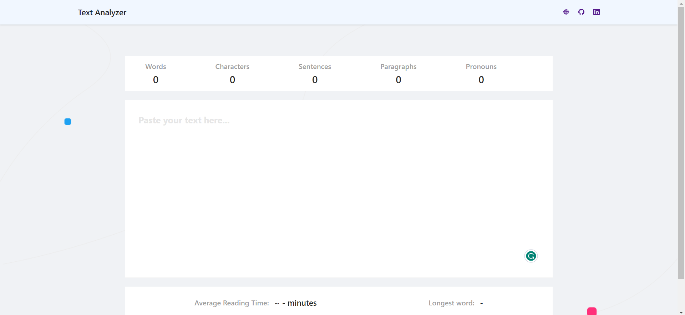

<!-- Created By Sudhanshu Patel 2023 -->

  

  <h1>Sudhanshu Portfolio</h1>
  <a href=""><strong>➥ Live Demo</strong></a>

 

## Screenshots of Project

## Live Project

[Click Here]()

## Created By :

- [@Sudhanshu Patel](https://github.com/sudhanshu287)

## 🚀 About Me

I'm a final-year computer science engineering student with a passion for front-end development. My goal is to develop scalable, maintainable, and user-friendly web applications that provide a seamless user experience. I am constantly learning and experimenting with new technologies and frameworks to find the best solutions to the problems at hand.

Throughout my academic journey, I have gained valuable experience in designing, developing, and testing software solutions for various real-world problems. 
I am proficient in programming languages such as 🔴 Java and 🔴 Javascript. My frontend tech stack includes technologies like 🟢 React.js, 🟢Bootstrap, 🟢HTML,🟢 CSS, 🟢 SASS, and tools like 🟡 VsCode, 🟡 Git, 🟡 GitHub, and 🟡 Postman.

## 🛠 Skills

Javascript,Java, Node.js, HTML, CSS, React.js ,C++

## Tech Stack

**Client:** React, SASS

## **Let's Connect 👋**

  &nbsp;&nbsp;&nbsp;

  &nbsp;&nbsp;&nbsp;

   &nbsp;&nbsp;&nbsp;

  

<!-- Created By Sudhanshu Patel 2023 -->

